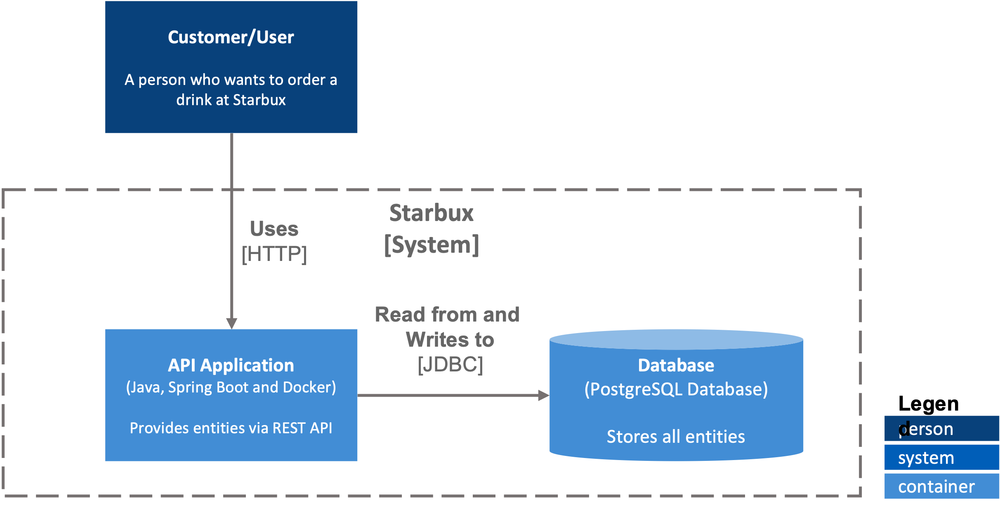

<h1>Starbux Backend</h1>

## About
We need a backend for our online coffee place startup, Starbux Coffee, where users can order
drinks/toppings and admins can create/update/delete drinks/toppings and have access to
reports.

# Functional Requirements
* Develop an API that will be used to order drinks with any of the topping combinations.
* Visitor journeys should be transparent, the current amount of the cart and the products
should be communicated back to the caller of the API.
* When finalizing the order, the original amount and the discounted amount should be
communicated back to the caller of the API.
* Reports are present with the criteria suggested in the admin API requirements.

This solution consists of one application implemented using Java (Spring Boot Service) which implements the business logics of the Starbux, more details about the application are pointed below:

* `starbux-backend`: Spring Boot service, responsible for creating and managing the necessary e-commerce entities stored in a PostgreSQL database server.

## Architecture

## Technologies
* `Spring Boot v2.5.0`, for creating RESTful API;
* `Spring Data`, for managing the Database Server entities;
* `JUnit`, used for unit testing of the application;
* `Swagger`, used for API documentation;
* `Lombok`, used for annotating getters and setters methods;
* `Model Mapper`, used for object mapping;
* `PostgreSQL`, used to store the necessary data;
* `Docker and Docker-Compose`, containerization of the services and linking containers;

## Installation
Follow these instructions in order to try the application.

### Prerequisites
Make sure you have installed all the following prerequisites on your development machine:
* `Java 17` and `Maven`, for building the `starbux-backend`;
* `Docker` and `Docker-Compose`, to build and run the application containers;

Also make sure that the following ports are available:
* `8080`, used for the openjdk container holding the `starbux-backend`;
* `5050`, used for the pgAdmin application;
* `5432`, used for the PostgreSQL Database Server;

### 1. Starbux Backend Application
Execute the following commands in order to build and generate the docker container images:
1. Enter the `starbux-backend` folder:  
   ``$ cd starbux-backend``
2. Execute the following maven command to clean the target folder and generate the distributable .jar file **(this command will ignore the unit tests)**:  
   ``$ mvn clean install -DskipTests``
3. Execute the Docker build to generate the docker container image:  
   ``$ docker build -t starbux-backend .``

### 2. Starbux Application (Docker-Compose)
From the root folder of this project execute the following commands.
1. First check if the image was successfully generated using the command:  
   ``$ docker image ls``

2. Execute the following command to setup the whole application and deploy:  
   ``$ docker-compose up -d``

3. You can access the API documentation accessing the following address:  
   ``http://localhost:8080/swagger-ui.html``

## Future Improvements
* `starbux-backend`:
    * Code instrumentation to collect service metrics (CPU and Memory usage, etc.) and forwarding to services like Elasticsearch or Grafana for data visualization;
    * Implementation of caching systems like Redis to improve performance of the system;
    * Add more code coverage on unit testing;
    * Add Terraform script for automatic deployment in a Cloud Environment;

* `General`:
    * Project build, versioning and deployment automatization using any CI/CD service and Maven Release Plugins to generate release snapshots;
    * Re-design of the solution to be a Cloud Native application beign capable of handling with autoscaling (Kubernetes and Cloud Native Apps or Serverless can be considered);
    
## Contributors
Nathan Ribeiro
* [Github](https://github.com/nathanlogus)
* [LinkedIn](https://www.linkedin.com/in/nathanlogus/)

## LICENSE

[MIT](LICENSE)
